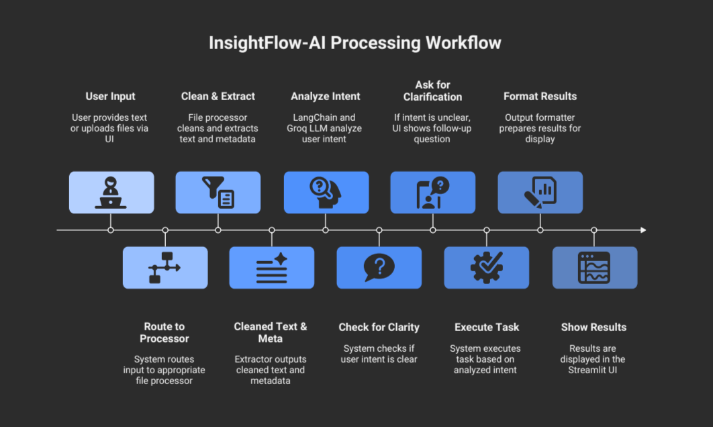

# **INSIGHTFLOW-AI 🤖 — Your All-Purpose Multimodal Assistant**

INSIGHTFLOW-AI is designed to make interacting with AI feel easy and intuitive. Instead of limiting you to one type of input, it works across **text, images, PDFs, audio files, and YouTube links**—then figures out what you want and delivers the right kind of response.

Whether you want a quick summary, help understanding code, a transcript, or just an answer to a question, the system adapts automatically.

---

## ✨ **What INSIGHTFLOW-AI Can Do**

Here’s a quick overview of the main abilities:

* Create summaries (short, structured, or detailed)
* Analyze sentiment with confidence scores and explanations
* Break down code step-by-step and point out potential issues
* Summarize YouTube videos or answer questions about them
* Transcribe audio and generate optional summaries
* Respond to general conversation or direct questions
* Ask for clarification if your request isn’t clear

**Tech inside:** LangChain, Groq (free API), Tesseract OCR, pdfplumber, youtube-transcript-api, Streamlit, FastAPI

---

## 🧠 **How the System Works**

<p align="center">
  
</p>

---

## 📥 **Supported Input Types**

* ✍️ **Text** — any written content
* 🖼 **Images** (`png`, `jpg`) — includes OCR to pull out embedded text
* 📄 **PDFs** — automatic text extraction
* 🎧 **Audio** — transcribed through Groq’s Whisper model
* 🎥 **YouTube URLs** — transcript fetched instantly

### Smart Intent Detection

The system uses LangChain to understand your request.
If it’s not totally sure what you mean, it asks **exactly one** quick follow-up question to clarify.

---

## ⭐ **What You Get Back**

| If You Ask For…       | You’ll Receive…                                                                      |
| --------------------- | ------------------------------------------------------------------------------------ |
| **Summary**           | A headline-style one-liner, three key points, and a clear paragraph overview         |
| **Sentiment**         | A label (positive/neutral/negative), a confidence score, and an explanation          |
| **Code Help**         | A high-level explanation, step-by-step logic, potential issues, and complexity notes |
| **YouTube Info**      | A summary or direct answers based on the transcript                                  |
| **Audio Processing**  | A full transcript, with an optional summary                                          |
| **General Questions** | A straightforward answer in plain English                                            |

---

## 🚀 **Getting Started**

### 1. Install Tesseract (for OCR)

INSIGHTFLOW-AI uses Tesseract to read text from images.

* **Windows:** Download from
  [https://github.com/UB-Mannheim/tesseract/wiki](https://github.com/UB-Mannheim/tesseract/wiki)
* **Linux:**

  ```bash
  sudo apt install tesseract-ocr
  ```
* **macOS:**

  ```bash
  brew install tesseract
  ```

---

### 2. Install Python Dependencies

```bash
pip install -r requirements.txt
```

Then create a `.env` file in your project folder and add:

```
GROQ_API_KEY=your_key_here
```

You can generate a free API key at: [https://console.groq.com](https://console.groq.com)

---

### 3. Launch the Streamlit Interface

```bash
streamlit run frontend/streamlit_app.py
```

This opens the app in your browser:

```
http://localhost:8501
```

<p align="center">
  
</p>

---

### 4. (Optional) Start the FastAPI Backend

```bash
uvicorn api.fastapi_app:app --reload
```

API docs become available at:

```
http://localhost:8000/docs
```

> The Streamlit app handles everything locally.
> Use FastAPI if you want a programmatic `/process` endpoint.

---

## 📝 Notes

* All LLM and speech-to-text tasks run on **Groq’s free tier**, so you don’t need paid credits.
* **Tesseract** handles OCR with no licensing issues.
* The pipeline uses LangChain modules, making it easy to extend or adapt.
* Both the **UI** and **API** versions are working end-to-end—no placeholder components.

---

